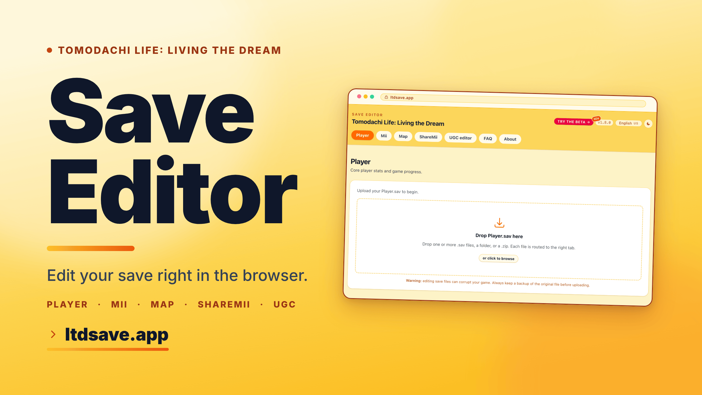

# Tomodachi Life: Living the Dream - Save Editor

  
  
  
   
  
  
  

A browser-based save editor for _Tomodachi Life: Living the Dream_ (Nintendo Switch). Drop your `Mii.sav`, `Player.sav`, and `Map.sav` files in, edit, and download a patched copy. Everything runs locally - files never leave your machine.

## Features

- **Player tab** - global/player state from `Player.sav`.
- **Mii tab** - per-Mii editing from `Mii.sav`.
- **Map tab** - island layout from `Map.sav`, with placement-aware footprints sourced from the game's `WalkingGrid` data.
- **UGC editor** - replace UGC textures (clothes, food, goods, exteriors, interiors, map objects, map floors) with your own images.
- **ShareMii** - import and export Miis and UGC items between save files, compatible with the [ShareMii](https://github.com/Star-F0rce/ShareMii) file format created by Star-F0rce.
- **Advanced** - raw hash-keyed entry browser for fields the structured tabs don't cover yet.

## Packages

The save-format core lives in standalone, published packages under [`packages/`](./packages). The editor consumes them as workspace dependencies, and they are reusable on their own:

- [`@alexislours/ltd-savedata`](./packages/ltd-savedata) - reader, writer, and reverse-engineered field schema for the game's binary `.sav` save format. Zero runtime dependencies.
- [`@alexislours/ltd-sharemii`](./packages/ltd-sharemii) - codec for the game's Mii and UGC share format: extract a Mii or UGC item from a save into a portable share file and apply it back. Depends only on `@alexislours/ltd-savedata`.
- [`@alexislours/ltd-textures`](./packages/ltd-textures) - Tegra/Switch block-linear (de)swizzle, BC1/BC3 transcode, sRGB/linear conversion, and image resize, in WebAssembly.

## Adding a Localization

Translations live in `messages/<locale>.json`. `en-US` is the source of truth; locales are auto-discovered at build time. Base PRs against the `dev` branch.

1. **Create the file.** Copy `messages/en-US.json` to `messages/<locale>.json` (e.g. `de-DE.json`, `ja-JP.json`).
2. **Backfill keys.** Run `npm run i18n:sync` to mirror the `en-US` structure into your new file.
3. **Translate.** Edit the values.
4. **Verify.** Run `npm run i18n:check`, then `npm run dev` and pick the new language from the switcher.
5. **Pre-flight.** Run `npm run precommit` before opening a PR to the `dev` branch.

If a language ships in multiple regional editions of the game (e.g. Spanish exists as both `USes` and `EUes`), you can offer both without duplicating the translation file. Add an alias to `aliases` in `tools/i18n-config.ts` (e.g. `'es-US': 'es-EU'`) and a UI-to-game mapping in `src/lib/sav/gameLocale.ts` (`'es-US': 'USes'`). Both tags then appear in the switcher, share the same UI strings, but pull region-specific game content.

## Credits

- [tlmodding/living-the-dream-save-editor](https://github.com/tlmodding/living-the-dream-save-editor) - For the base structure of the save file
- [tlmodding/ltd-gamedata](https://github.com/tlmodding/ltd-gamedata) - early reference for save key hashes.
- [Star-F0rce](https://github.com/Star-F0rce/ShareMii) - For creating the ShareMii tool.

## Disclaimer

This is an unofficial, fan-made tool. _Tomodachi Life: Living the Dream_ is © Nintendo.

## License

[AGPL-3.0-or-later](./LICENSE)
